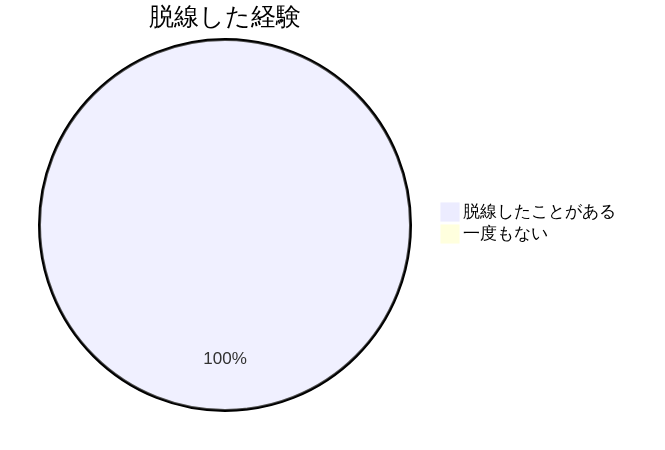
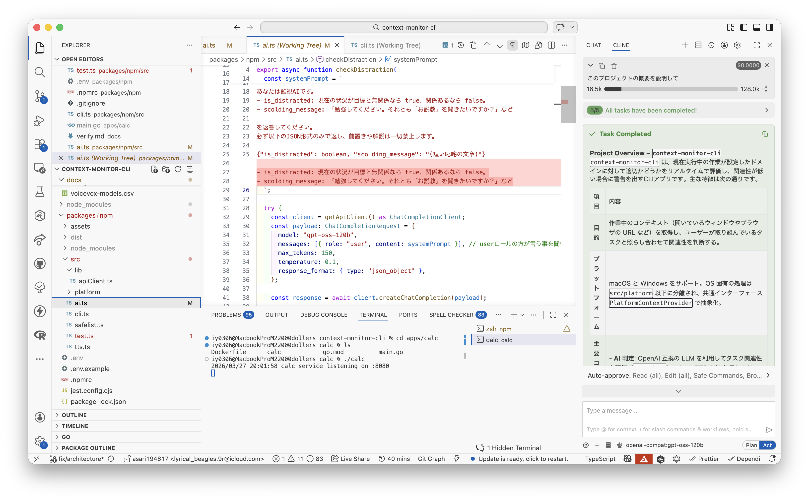

<!-- paginate: true -->
<!-- _class: lead -->

# 作業を理解して監視するCLIの開発

チーム (タクシーの絵文字)

---
# 開発でAI使ってるよって人🙋‍♂️

---
# LLM待ちで別のこと始めて
# 戻れなくなったことあるって人🙋‍♂️

---
# そのまま戻れなくなること、よくありますよね

---
# 実際、多くの人がこの経験をしている



---
# 実際、多くの人がこの経験をしている


n=3, チームメンバーを対象

---
# じゃあどうする

---

# 機械に検知して警告してもらう

- 関係のないサイトをブロックしてくれるアプリはたくさんある
- スクリーンタイムなどで簡単に始められるし、商用サービスもある

---
# ただし
- その時のタスクによって関係ないサイトは変わる
  - 仕事中にアマプラは見ないけどOA用品は見るかも
- サイトのブロックを一つずつやるのは非常に手間がかかる
  - 実際、データ販売が商売になってたりする

---
# デモンストレーション

---
# 結果

## 母集団の全員が「余計な作業が減った」と回答


---
## 母集団の全員が「余計な作業が減った」と回答


n=3, チームメンバーを対象

---
# AIで解決する
- AIを使って、その時の作業に関係があるかどうかを判定する
- 実際の作業により忠実に判定ができるようになる

---
# 開発におけるAI利用

## APIクライアント
コンテキストを抑えつつ安全な開発をするために、APIクライアントをnpmにした

### 1
`npmrc`に`@kloud-taxi:registry=https://npm.pkg.github.com`を設定

### 2
```bash
npm install @kloud-taxi/api-client
```

---

### 3

```ts
import { createClient } from "@kloud-taxi/api-client";

export const client = createClient({
  apiKey: process.env.SAKURA_API_KEY ?? "",
});
```

---
### 4

```ts
import { client } from "@/lib/client";

const response = await client.createChatCompletion({
  model: "sakura-chat-1",
  messages: [
    { role: "system", content: "あなたは親切なアシスタントです。" },
    { role: "user", content: "こんにちは" },
  ],
  temperature: 0.7,
});

```

---

## ClineでAPIを利用

- ClineというVSC拡張機能を使うことで、OpenAPI互換のAPIをGitHub Copilotのように扱える
- 参考: [シェルスクリプトマガジン vol.100](https://shell-mag.com)



---
## ClineでAPIを利用

- このためにGitHubの`docs/`をSSOTとしてNotionなどを使わないで開発した
- ただしCline独自の機能である`Native Tool Call`は無効化しておかないと永遠に警告が出る
- ここら辺は今後Qiitaの記事にする予定
---

# 苦労したこと: プロンプトの与え方

```
目標: ${objective}
現在の状況: ${title} (URL: ${url})

あなたは監視AIです。
- is_distracted: 現在の状況が目標と無関係なら true、関係あるなら false。
- scolding_message: 「勉強してください。それとも「お説教」を聞きたいですか？」など

を返答してください。
必ず以下のJSON形式のみで返し、前置きや解説は一切禁止します。

{"is_distracted": boolean, "scolding_message": "(短い叱咤の文章)"}

- is_distracted: 現在の状況が目標と無関係なら true、関係あるなら false。
- scolding_message: 「勉強してください。それとも「お説教」を聞きたいですか？」など
```

---
## 失敗例

- 項目の一覧をJSONの下に持ってくると間違ったJSONを返してしまう
- `"(短い叱咤の文章)"`の部分
  - `(短い叱咤の文章)`とするとダブルクォーテーションのないJSONを返してしまい、`parse`できない
  - `string`とし別の場所に説明を入れるとなぜかJSONが崩れる
  - `"短い叱咤の文章"`とすると文字列をそのまま返してしまう
- 2回返却値の説明をしないとJSONが崩れやすくなる
- JSON以外にもコードブロックの形式で返してくることがある→正規表現でJSONの始まりを検出して対応

---
# 諦めたこと

- 改竄の検知
  - Amazon AppRunnerで、タイムスタンプを含めた上でJSONから数値を生成するステートレスなサーバーを構築
  - ガウスの時計計算を連鎖的に用い、改ざんがないことを証明
  - 途中まで行ったけど時間が足りなかった
- Webサーバー上に記録を保存・閲覧
  

---
# まとめ

- 作業を理解して監視するCLIを開発した
- npmパッケージでAPIを隠蔽したりしてAIネイティブな開発をした
- プロンプトの調整が大変だった

---
# 質疑応答

---
# なぜAWS?

- メンバーに開発経験があったから
- TerraformとしてAIに記述させるにあたって、AIが持っている情報が一番多いのがシェアの高いAWSだと考えたから
- MCPサーバーを提供しているから
- `awsdac`でビジュアライズまでコードとして完結できるから

---